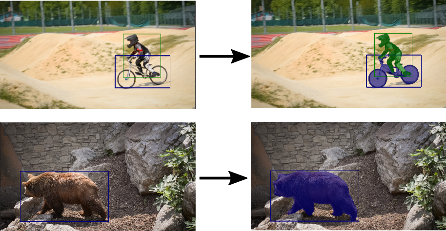

# Segmentation Masks From Bounding Boxes Using PointRend

**Summary**: Convert object bounding boxes to pixel-precise segmentation masks.

 

This repository uses [PointRend](https://github.com/zsef123/PointRend-PyTorch) to achieve this. No dedicated models are trained for this task. Instead we just use the PointRend based mask segmentation heads available from pre-trained Mask-RCNN models.

## Setup

- Python 3.7
- PyTorch (v1.11)
- Detectron2 (v0.6) [(installation instructions)](https://github.com/facebookresearch/detectron2/blob/main/INSTALL.md)
- Numpy

The code works with the version numbers above, but should work on similar versions too.

## Usage

- You will need the model checkpoints for Mask-RCNN with PointRend based mask head. Download links for these are given under the Detectron2 framework [here](https://github.com/facebookresearch/detectron2/tree/main/projects/PointRend#instance-segmentation). For the best performance in a general setting, use the largest model trained on COCO Instance Segmentation with the `X101-FPN` backbone.
- There is a config file associated with each checkpoint. These are present in the [Detectron2 PointRend project](https://github.com/facebookresearch/detectron2/tree/main/projects/PointRend/configs/InstanceSegmentation), but I also copied them to this repo in the `pointrend_configs` directory. 

- See `demo.py` for a basic use case. It uses an image saved in `example_images`. Run it as follows:

```
python pointrendbox2mask/demo.py --config pointrend_rcnn_X_101_32x8d_FPN_3x_coco.yaml --model_checkpoint /path/to/pretrained/checkpoint.pkl
```
 
- There is also an interactive interface to try out the model on your own image. For this, run `demo_interactive.py` as follows:

```
python pointrendbox2mask/demo.py --config pointrend_rcnn_X_101_32x8d_FPN_3x_coco.yaml --model_checkpoint /path/to/pretrained/checkpoint.pkl --image /path/to/some/image.jpg
```

A window will open up showing the image. You can draw a rectangle on the image and the model will then segment a mask using this box. Draw the rectangle by starting at the top-left corner and drag the mouse cursor down to the bottom-right.
